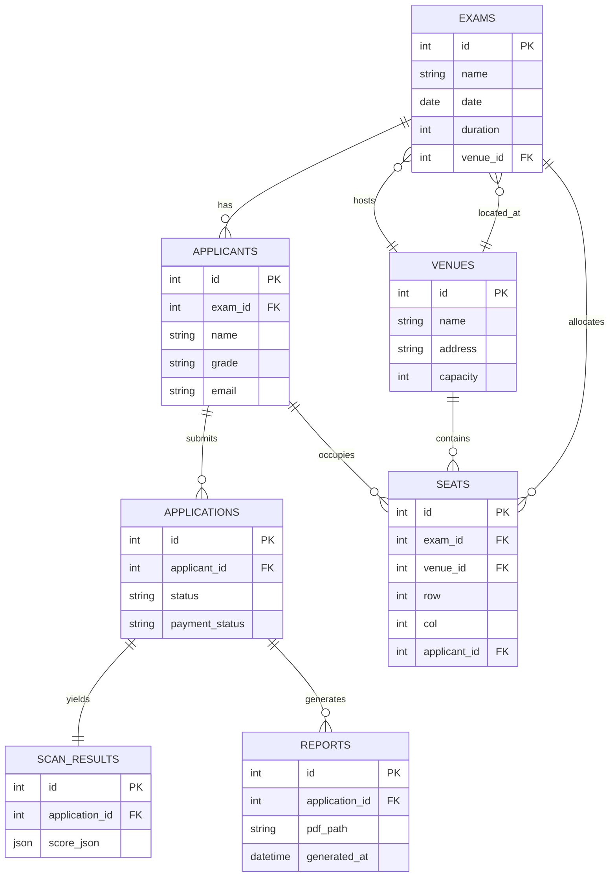

```mermaid
erDiagram
    EXAMS {
        int id PK
        string name
        date date
        int duration
        int venue_id FK
    }
    VENUES {
        int id PK
        string name
        string address
        int capacity
    }
    APPLICANTS {
        int id PK
        int exam_id FK
        string name
        string grade
        string email
    }
    APPLICATIONS {
        int id PK
        int applicant_id FK
        string status
        string payment_status
    }
    SEATS {
        int id PK
        int exam_id FK
        int venue_id FK
        int row
        int col
        int applicant_id FK
    }
    SCAN_RESULTS {
        int id PK
        int application_id FK
        json score_json
    }
    REPORTS {
        int id PK
        int application_id FK
        string pdf_path
        datetime generated_at
    }

    VENUES ||--o{ EXAMS           : hosts
    EXAMS   }o--|| VENUES         : located_at

    EXAMS   ||--o{ APPLICANTS     : has
    APPLICANTS ||--o{ APPLICATIONS : submits
    APPLICATIONS ||--|| SCAN_RESULTS : yields
    APPLICATIONS ||--o{ REPORTS      : generates

    EXAMS   ||--o{ SEATS          : allocates
    VENUES  ||--o{ SEATS          : contains
    APPLICANTS ||--o{ SEATS        : occupies
```
