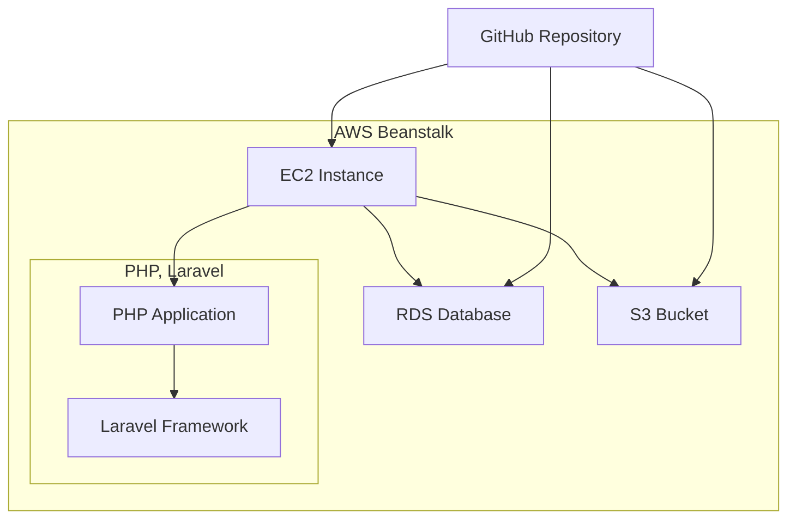

# 🏁 概要 - Overview

Cuvra はLINE botシステム用のLaravelプロジェクトです。 
LINE APIを使用し、Webシステム上でLINEリッチメニューの作成や 
それに伴う機能を提供します。

## システム構成図

- 開発環境はDockerを使用
- ソースコードの管理はGithubを使用
- CI/CDパイプラインはGithub Actionsを使用
- 本番環境はAWS Beanstalkを使用

## 背景

以前より構想していたLINEマーケティングツールを形にするべく、2023年より開発開始。

## 定義

専門用語の定義はここに記述する。

- オーナー: LINEアカウントを運用する個人・企業。運営者はオーナーから料金を受け取る。
